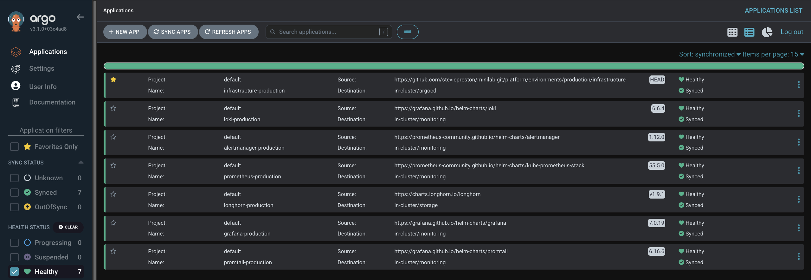
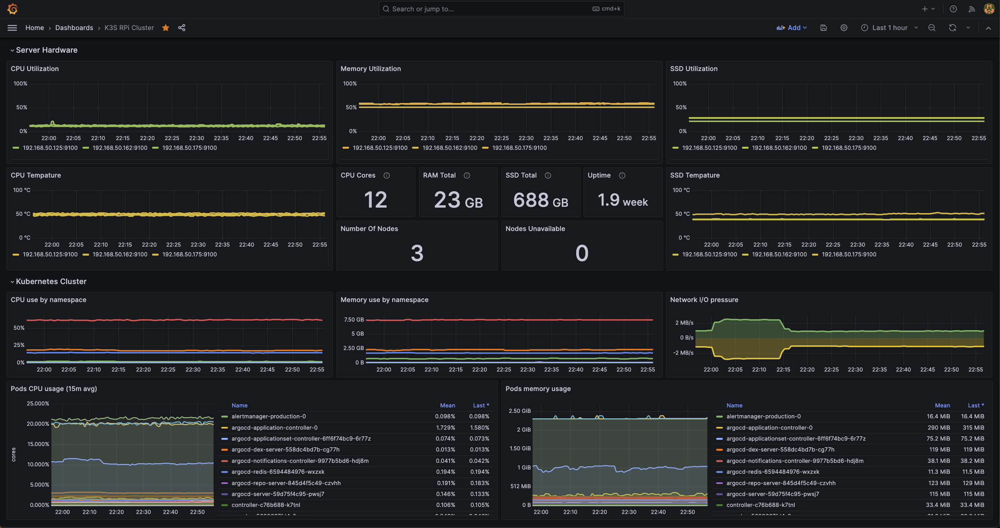

## StevieP's Minilab

### Plan

I decided to use the GitOps approach using the apps of apps pattern, using git as the source of 
truth. Argo CD allows me to leverage helm charts and values files to deploy infrastructure, using
yaml configuration. Ansible was used to get the initial software and dependencies installed on the 
Raspberry Pi's. The MiniLabs end goal is to mimic a sophisticated modern production environment.

### Architecture 

_TODO: Insert Lucid Chart Architecture_ 

### Why

My professional role is Site Reliability Engineer, It is only natural I have a curiosity of 
designing and building an environment which can scale and resilient to incidents building 
robust automation to eliminate toil and auto-remediation based on SLI's. 

### What

This is a local gitops K3s cluster utilizing Raspberry Pi 5's, the plan is to have the total of 6x Raspberry Pis, and a Mini PC confined within a 10inch 8u Server rack. Should have enough hardware to mock a production environment. With subsequent resources to host self written software and self hosted SaaS with SRE in mind with full observability(Traces, Logs, Metrics) with paging via Alertmanager. Full scale production ready server, with less at risk, to practice self healing systems, graceful degradation, implementing scaleable fault tolerant systems with scalability in mind with minimising MTTD and MTTR within resource constraints.

